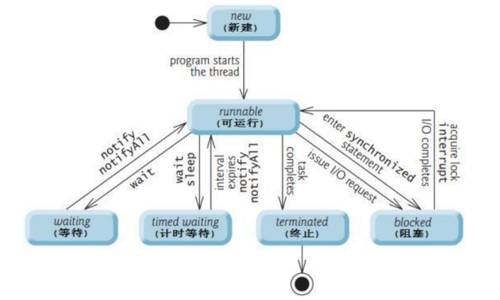
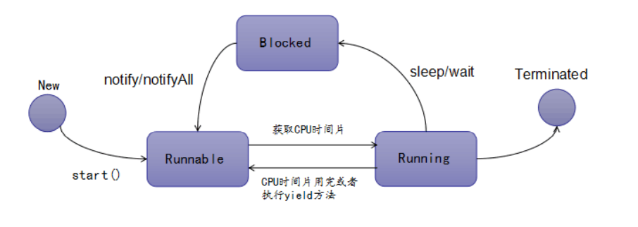

## 多线程、Synchronized、JUC(java.util.concurrent)

* 什么是死锁，死锁如何产生的，如何避免，实际开发中有没有遇到？

  ```java
  死锁就是有两个或者多个进程由于竞争资源而造成阻塞的现象，如果无外力作用，这种局面就会一直持续下去。
  死锁产生必须满足四个必要条件：
  1、互斥条件：同一时间只能有一个线程获取资源。
  2、不可剥夺条件：指进程已获得的资源，在未使用完之前，不能被剥夺，只能在使用完时由自己释放。
  3、请求和保持条件：指进程已经保持至少一个资源，但又提出了新的资源请求，且对自己已获得的其它资源保持不放。
  4、循环等待条件：多个线程互相等待对方释放资源，形成闭环。
  死锁预防，那么就是需要破坏这四个必要条件
  1、由于资源互斥是资源使用的固有属性，是必须的，不仅不能改变，还应该保证，我们不讨论。
  2、破坏不可剥夺条件:一个线程不能获得所需要的全部资源便处于等待状态，等待期间应该把它所占有的资源重新加入到系统的资源列表中，可以被其他的线程使用，而等待的线程只有重新获得自已原有资源以及新申请的资源才可启动，执行
  3、 第一种方法静态分配即每个线程在开始执行时就申请他所需要的全部资源
      第二种是动态分配即每个线程在申请所需要的资源时他本身不占用系统资源
  4、破坏环路等待条件：会出现死锁的两两组合，就像一件商品150元，其中A拿了50元，B拿了100元，我们可以给资源从小到大编号，只有获得了小的才有资格去拿大的。
  ```

* 说说线程有哪些状态,阻塞和等待有什么区别，描述一下线程的生命周期？

  ```java
  按JDK的源码分析来看，Thread的状态分为：
  1. NEW： 尚未启动的线程的线程状态
  2. RUNNABLE： 处于可运行状态的线程正在Java虚拟机中执行，但它可能正在等待来自操
  作系统（例如处理器）的其他资源
  3. BLOCKED： 线程的线程状态被阻塞，等待监视器锁定。处于阻塞状态的线程正在等待
  监视器锁定以输入同步的块方法或在调用后重新输入同步的块方法，通过 Object#wait()
  进入阻塞
  4. WAITING：处于等待状态的线程正在等待另一个线程执行特定操作：例如: 在对象上调用了Object.wait（）的线程正在等待另一个线程调用Object.notify（） 或者Object.notifyAll(), 调用了 Thread.join（）的线程，正在等待指定的线程终止
  5. TIMED_WAITING ： 具有指定等待时间的等待线程的线程状态。由于以指定的正等待时间调用以下方法之一，因此线程处于定时等待状态：
      1. Thread.sleep（long）
      2. Object#wait(long)
      3. Thread.join（long）
      4. LockSupport.parkNanos（long...）
      5. LockSupport.parkUntil（long...）
  6. TERMINATED: 终止线程的线程状态。线程已完成执行
  ```

  

  ```java
  线程的生命周期大致包括五个阶段：
  1. 新建 就是刚使用new方法，new出来的线程；
  2. 就绪 就是调用的线程的start()方法后，这时候线程处于等待CPU分配资源阶段，谁先抢的CPU资源，谁开始执行;
  3. 运行 当就绪的线程被调度并获得CPU资源时，便进入运行状态，run方法定义了线程的操作和功能;
  4. 阻塞 在运行状态的时候，可能因为某些原因导致运行状态的线程变成了阻塞状态，比如sleep()、wait()之后线程就处于了阻塞状态，这个时候需要其他机制将处于阻塞状态的线程唤醒，比如调用notify或者notifyAll()方法。唤醒的线程不会立刻执行run方法，它们要再次等待CPU分配资源进入运行状态;
  5. 销毁 如果线程正常执行完毕后或线程被提前强制性的终止或出现异常导致结束，那么线程就要被销毁，释放资源
  ```

  

* 线程的创建方式，线程是怎样实现的，获取多线程的方法有几种？(高频四种)

  ```java
  传统的是继承thread类和实现runnable接口
  java5以后又有实现callable接口+ FutureTask和java的线程池获得
  ```

* Callable接口与Runnable接口的区别？

  ```java
  相同点：都是函数式接口，都可以编写多线程程序，都采用Thread.start()启动
  
  不同点：
  * 具体方法不同，一个是run(),一个是call()
  * Runnable没有返回值，Callable可以返回执行结果，是个泛型
  * Callable接口的call（）方法允许抛出异常，Runnable的run（）方法异常只能在内部消化，不能往上继续抛。
  * Callable需要FutrueTask才能初始化多线程程序
  * Callable提供了检查计算是否完成的方法,以等待计算的完成，并检索计算的结果。 
  ```

* Java中的wait和sleep的区别与联系？

  ```java
  1. 所属类: 首先，这两个方法来自不同的类分别是Thread和Object ，wait是Object的方法，sleep是Thread的方法。
      /**sleep方法属于Thread类中方法，表示让一个线程进入睡眠状态，等待一定的时间之后，自动醒来进入到可运行状态，不会马上进入运行状态，因为线程调度机制恢复线程的运行也需要时间，一个线程对象调用了sleep方法之后，并不会释放他所持有的所有对象锁，所以也就不会影响其他进程对象的运行。但在sleep的过程中过程中有可能被其他对象调用它的interrupt(),产生InterruptedException异常，如果你的程序不捕获这个异常，线程就会异常终止，进入TERMINATED状态，如果你的程序捕获了这个异常，那么程序就会继续执行catch语句块(可能还有finally语句块)以及以后的代码;而wait会释放锁。*/
  2.作用范围: sleep方法没有释放锁，只是休眠，而wait释放了锁，使得其他线程可以使用同步控制块或方法。
  3、使用范围: wait，notify和notifyAll只能在同步控制方法或者同步控制块里面使用，而sleep可以在任何地方使用。
  4、异常范围： sleep必须捕获异常，而wait，notify和notifyAll不需要捕获异常
  ```

* 描述一下进程与线程区别？

  ```java
  1. 进程（Process）：
  进程是系统进行资源分配和调度的基本单位，是操作系统结构的基础。在当代面向线程设计的计算机结构中，进程是线程的容器。程序是指令、数据及其组织形式的描述，进程是程序的实体。是计算机中的程序关于某数据集合上的一次运行活动，是系统进行资源分配和调度的基本单位，是操作系统结构的基础。总结: 进程是指在系统中正在运行的一个应用程序；程序一旦运行就是进程；进程——资源分配的最小单位
  2. 线程(Thread)：
  操作系统能够进行运算调度的最小单位。它被包含在进程之中，是进程中的实际运作单位。一条线程指的是进程中一个单一顺序的控制流，一个进程中可以并发多个线程，每条线程并行执行不同的任务。总结: 系统分配处理器时间资源的基本单元，或者说进程之内独立执行的一个单元执行流。线程——程序执行的最小单位
  ```

* 程序开多少线程合适？(重要)

  ```shell
  简单概况：
  首先确认业务是CPU密集型还是IO密集型的，
  如果是CPU密集型的，那么就应该尽量少的线程数量，一般为CPU的核数+1；
  如果是IO密集型：所以可多分配一点 cpu核数*2 也可以使用公式：CPU 核数 / (1 - 阻塞系数)；其中阻塞
  系数 在 0.8 ～ 0.9 之间。
  详细：
  首先确认业务是CPU密集型还是IO密集型的，
  1. CPU 密集型程序， 一个完整请求，I/O操作可以在很短时间内完成， CPU还有很多运算要处理，也就是说 CPU 计算的比例占很大一部分，线程等待时间接近0。
      1. 单核CPU： 一个完整请求，I/O操作可以在很短时间内完成， CPU还有很多运算要
      处理，也就是说 CPU 计算的比例占很大一部分，线程等待时间接近0。单核CPU处
      理CPU密集型程序，这种情况并不太适合使用多线程，
      2. 多核 ： 如果是多核CPU 处理 CPU 密集型程序，我们完全可以最大化的利用 CPU
      核心数，应用并发编程来提高效率。CPU 密集型程序的最佳线程数就是：因此对于
      CPU 密集型来说，理论上 线程数量 = CPU 核数（逻辑），但是实际上，数量一般
      会设置为 CPU 核数（逻辑）+ 1（经验值）
      计算(CPU)密集型的线程恰好在某时因为发生一个页错误或者因其他原因而暂停，
      刚好有一个“额外”的线程，可以确保在这种情况下CPU周期不会中断工作
  2. I/O 密集型程序，与 CPU 密集型程序相对，一个完整请求，CPU运算操作完成之后还有很多 I/O 操作要做，也就是说 I/O 操作占比很大部分，等待时间较长，线程等待时间所占比例越高，需要越多线程；线程CPU时间所占比例越高，需要越少线程。
      1. I/O 密集型程序的最佳线程数就是： 最佳线程数 = CPU核心数 (1/CPU利用率) = CPU核心数 (1 + (I/O耗时/CPU耗时))
      2. 如果几乎全是 I/O耗时，那么CPU耗时就无限趋近于0，所以纯理论你就可以说是2N（N=CPU核数），当然也有说 2N + 1的，1应该是backup
      3. 一般我们说 2N + 1 就即可
      参考：https://www.cnblogs.com/caijunchao/p/12991504.html
  ```

* 讲一讲多线程，手写两个线程排序执行，三个线程（两个线程）依次打印几种实现方式?

* 怎么提高多线程的执行效率（使用线程池吧，不然还能怎么样）？

* 线程池中的线程怎么添加一个线程，删除一个线程？

* 线程池的好处？线程池用在项目哪些地方？

* 异步编排怎么实现的

  ```java
  项目中查询商品详情页的时候要远程调用商品管理微服务，库存微服务，营销属性微服务，查询商品的销售属性，营销属性等信息，因为这些接口的调用是无顺序的，jdk1.8为我们提供了一个CompleteableFuture类，有50个方法，方便我们实现异步编排，通过调用有返回值和无返回值方法，创建异步任务交给线程池执行，调用allof和join方法进行编排和执行。
  ```

* 线程池的参数有哪些，核心线程数和最大线程数一般多少？（结合程序开多少线程回答）

* 线程池的工作队列有哪些，是什么类型？

* 线程池参数了解吗，实现原理知道吗，知道为什么要使用阻塞队列而不使用队列吗，线程池类型以及是怎么创建的?

  7个重要参数：

  ```java
  corePoolSize:核心线程数
  maximumPoolSize:最大可扩展线程数
  keepAliveTime:生存时间
  TimeUnit:时间单位
  workQueue：阻塞队列：阻塞队列会对当前线程产生阻塞，比如一个线程从一个空的阻塞队列中取元素，此时线程会被阻塞直到阻塞队列中有了元素。当队列中有元素后，被阻塞的线程会自动被唤醒（不需要我们编写代码去唤醒）
  threadFactory：线程工厂
  handler：拒绝策略
  ```

  线程池底层工作原理：

  ```java
  * 初始化线程池，线程数为0
  * 通过submit、execute方法向线程池提交任务时，线程会做如下判断：
  * 判断核心线程数是否已满，未满则创建新的线程处理任务
  * 如果核心线程数已满，再去判断阻塞队列是否已满，未满则放入阻塞队列
  * 如果阻塞队列已满，再去判断最大可扩展线程数是否已满，未满则创建新的线程处理任务
  * 如果最大可扩展已满，则交给拒绝策略（四个拒绝策略：AbortPolicy:一旦触发就会抛出异常，CallerRunsPolicy:调用者执行，DisCardOldestPolicy:丢弃等待最久的，DisCardPolicy：默默的丢弃任务，自定义拒绝策略：实现RejectedExecutionHandler接口）
  * 一个线程处理完任务之后，从阻塞队列中获取新的任务
  * 一个线程空闲时间到达生存时间，判断当前线程数是否大于核心线程数。大于则销毁该线程，直到回缩至核心线程数
  ```

  使用阻塞队列原因，excute与submit区别：

  ```
  * 一般的队列只能保证作为一个有限长度的缓冲区，如果超出了缓冲长度，就无法保存当前的任务了，阻塞队列通过阻塞可以保留住当前想要继续入队的任务。
  * excute和submit区别，submit有返回值，而excute没有，submit方便exception的处理。
  ```

  线程池创建方式：Executor工具类创建或者自定义线程池：阿里手册推荐自定义线程池，并设置线程名。[参考](https://www.cnblogs.com/vince66/p/9325638.html)

  ```java
  1、newCachedThreadPool()（工作队列使用的是 SynchronousQueue）
  创建一个线程池，如果线程池中的线程数量过大，它可以有效的回收多余的线程，如果线程数不足，那么它可
  以创建新的线程。
  不足：这种方式虽然可以根据业务场景自动的扩展线程数来处理我们的业务，但是最多需要多少个线程同时处
  理却是我们无法控制的。
  优点：如果当第二个任务开始，第一个任务已经执行结束，那么第二个任务会复用第一个任务创建的线程，并
  不会重新创建新的线程，提高了线程的复用率。
  作用：该方法返回一个可以根据实际情况调整线程池中线程的数量的线程池。即该线程池中的线程数量不确
  定，是根据实际情况动态调整的。
  2、newFixedThreadPool()（工作队列使用的是 LinkedBlockingQueue）
  这种方式可以指定线程池中的线程数。如果满了后又来了新任务，此时只能排队等待。
  （2）线程池的参数
  （3）拒绝策略
  优点：newFixedThreadPool 的线程数是可以进行控制的，因此我们可以通过控制最大线程来使我们的服务
  器达到最大的使用率，同时又可以保证即使流量突然增大也不会占用服务器过多的资源。
  作用：该方法返回一个固定线程数量的线程池，该线程池中的线程数量始终不变，即不会再创建新的线程，也
  不会销毁已经创建好的线程，自始自终都是那几个固定的线程在工作，所以该线程池可以控制线程的最大并发
  数。
  3、newScheduledThreadPool()
  该线程池支持定时，以及周期性的任务执行，我们可以延迟任务的执行时间，也可以设置一个周期性的时间让
  任务重复执行。该线程池中有以下两种延迟的方法。
  scheduleAtFixedRate 不同的地方是任务的执行时间，如果间隔时间大于任务的执行时间，任务不受执行
  时间的影响。如果间隔时间小于任务的执行时间，那么任务执行结束之后，会立马执行，至此间隔时间就会被
  打乱。
  scheduleWithFixedDelay 的间隔时间不会受任务执行时间长短的影响。
  作用：该方法返回一个可以控制线程池内线程定时或周期性执行某任务的线程池。
  4、newSingleThreadExecutor()
  这是一个单线程池，至始至终都由一个线程来执行。
  作用：该方法返回一个只有一个线程的线程池，即每次只能执行一个线程任务，多余的任务会保存到一个任务
  队列中，等待这一个线程空闲，当这个线程空闲了再按 FIFO 方式顺序执行任务队列中的任务。
  5、newSingleThreadScheduledExecutor()
  只有一个线程，用来调度任务在指定时间执行。
  作用：该方法返回一个可以控制线程池内线程定时或周期性执行某任务的线程池。只不过和上面的区别是该线
  程池大小为 1，而上面的可以指定线程池的大小。
  自定义线程池：
  @Configuration
  public class ThreadPoolConfig {
      @Value("${threadPool.coreSize}")
      private int coreSize;
      @Value("${threadPool.maxSize}")
      private int maxSize;
      @Value("${threadPool.keepAlive}")
      private int keepAlive;
      @Value("${threadPool.arrayCapacity}")
      private int arrayCapacity;
      @Bean
      public ThreadPoolExecutor threadPoolExecutor(){
          return new ThreadPoolExecutor(coreSize, maxSize, keepAlive, TimeUnit.SECONDS, new ArrayBlockingQueue<>(arrayCapacity), Executors.defaultThreadFactory(),(Runnable r, ThreadPoolExecutor executor)->{
  //            log.warn("执行了拒绝策略");
          });
      }
  }
  ```

* 说说你对Threadlocal的理解，如何导致内存泄露，如何销毁？

* 什么情况线程不安全,那么怎么做到线程安全？

  ```
  * 多线程在同一时刻对一个共享资源做写操作（读操作不会涉及线程不安全），和我们的预期结果不一样，就出现了线程不安全问题。
  * 加锁
  ```

* 一个controller并发访问安全吗

  ```
  * controller默认是单例的，一般是安全的，但是在controller中使用了实例变量，就可能出现线程不安全的情况。
  * 解决方法：不要在 Controller 中定义成员变量，万一必须要定义一个非静态成员变量时候，则通过注解 @Scope(“prototype”)，将其设置为多例模式，在 Controller 中使用 ThreadLocal 变量；
  ```

* volatile的作用

  ```
  * 内存可见性：当对非volatile变量进行读写的时候，每个线程先从主内存拷贝变量到CPU缓存中，如果计算机有多个CPU，每个线程可能在不同的CPU上被处理，这意味着每个线程可以拷贝到不同的CPU cache中。volatile变量不会被缓存在寄存器或者对其他处理器不可见的地方，保证了每次读写变量都从主内存中读，跳过CPU cache这一步。当一个线程修改了这个变量的值，新值对于其他线程是立即得知的。**每次`读取前`必须先从主内存刷新最新的值，每次写入后必须立即同步回主内存中。**
  * 有序性：防止指令重排，通过内存屏障
  * 无法保证原子性：
  * 简化的同步机制，简化版的synchronized，不会阻塞线程，写的操作稍微慢一些，因为写会有内存屏障，读的性能完全没有影响。
  ```

* 线程安全的集合有哪些，hashmap原理，它是线程安全的吗？

* ConcurrentHashmap底层原理？

* 并发包下都用过那些类,对应的业务场景是什么？

* JUC的包用过没有，里面读写安全的map是什么？

* 说一下锁？

  ```
  在并发编程中，经常会遇到多个线程访问同一个共享资源，这个时候就必须考虑维护数据的一致性，在java中的synchronized（同步锁）关键字和juc（java.util.concurrent包）中的Lock锁。
  ```

* Java中锁的实现方式，请解释一下悲观锁和乐观锁，什么是乐观锁？什么又是悲观锁？

  ```
  * 悲观锁就是悲观思想，即认为写多，遇到并发写的可能性高，每次去拿数据的时候都认为别人会修改，所以每次在读写数据的时候都会上锁，这样别人想读写这个数据的时候就会阻塞，直到拿到锁。**
  
  * Java中的悲观锁就是Synchronized,AQS框架下的锁则是先尝试cas乐观锁算法去获取锁，获取不到，才会转换为悲观锁，如 RetreenLock。
  
  * 乐观锁是一种乐观思想，即认为读多写少，遇到并发写的可能性低，每次去拿数据的时候都认为别人不会修改，所以不会上锁，但是在更新的时候会判断一下在此期间别人有没有去更新这个数据，采取在写时先读出当前版本号，然后加锁操作（比较跟上一次的版本号，如果一样则更新），如果失败则要重复读-比较-写的操作。
  
  * Java中的乐观锁基本都是通过CAS操作实现的，CAS 是一种更新的原子操作，比较当前值跟传入值是否一样，一样则更新，否则失败。
  
  注意：CAS（compare and swap）是解决多线程并发安全问题的一种乐观锁算法。因为它在对共享变量更新之前，会先比较当前值是否与更新前的值一致，如果一致则更新，如果不一致则循环执行（称为自旋锁），直到当前值与更新前的值一致为止，才执行更新。 自旋锁（SpinLock）是指：尝试获取锁的线程不会立即阻塞，而是采用循环的方式去尝试获取锁，可以自旋一会就获得锁，减少线程上下文切换的消耗，缺点是循环会消耗CPU，实际开发一般不会一直获取不到锁。
  ```

* 乐观锁与悲观锁的区别，高并发的情况下使用哪个

  ```
  * 区别见上
  * 高并发悲观锁比较适合写入操作比较频繁的场景，如果出现大量的读取操作，每次读取的时候都会进行加锁，这样会增加大量的锁的开销，降低了系统的吞吐量。
  * 乐观锁比较适合读取操作比较频繁的场景，如果出现大量的写入操作，数据发生冲突的可能性就会增大（ABA对依赖过程值的情景的运算结果影响很大），为了保证数据的一致性，应用层需要不断的重新获取数据，这样会增加大量的查询操作，降低了系统的吞吐量。
  * 乐观锁是基于cas实现的,高并发场景下，需要无限自旋，浪费资源，存在性能问题，所以使用悲观锁。**
  ```

* 用过哪些锁？他们是乐观锁还是悲观锁？使用层面lock是悲观锁还是乐观锁？

* 自旋锁有了解过吗？

* 锁的几种类型，它们有什么区别，具体怎么实现的

* synchronized的底层说一下？synchronized怎么优化？

* java公平锁原理？

* synchronized和static synchronized的区别？

* synchronized关键字：悲观的独占的排他的互斥的非公平的可重入的重量级锁

  ```
  * 静态同步方法锁类
  * 普通同步方法锁对象
  * 同步代码块锁的是小括号中的资源
  * 而静态同步方法（Class对象锁）与非静态同步方法（实例对象锁）之间是不会有竞态条件的。
  ```

* juc中ReentrantLock：悲观的独占的排他的互斥的可公平可非公平的可重入的重量级锁

  ```
  * ReentrantReadWriteLock：可重入的读写锁
      写写不可并发的
      读写不可并发的
  	读读可以并发的
  ```

* ReentrantLock和synchronized区别（*2）

  ```java
  * 都是悲观的独占的排他的互斥的重量级锁，synchronized自动加锁和解锁，使用起来更加简单ReentrantLock手动加锁和解锁，使用起来相对麻烦一点，更加灵活。
  * 它们都是可重入的，synchronized不需要考虑加锁次数；ReentrantLock加解锁次数必须一致
  * ReentrantLock是可非公平的也可公平的；synchronized是公平的
  * ReentrantLock是具体的实现类，synchronized是一个关键字，无法查看源代码
  * synchronized不能响应中断；ReentrantLock可以响应中断
  * 线程通信方式不同：synchronized（wait notify、notifyAll） ReentrantLock（condition对象：await singal、singalAll）
  ```

* CountDownLatch 与 join 方法的区别？

  ```
  调用一个子线程的join（）方法后，该线程会一直被阻塞直到该线程运行完毕，等待的任务必须都执行完才能放行；CountDownLatch在任何地方调用countdown方法放行，而不一定必须等线程结束。另外使用线程池来管理线程时候一般都是直接添加 Runnable 到线程池这时候就没有办法在调用线程的 join 方法了，countDownLatch 相比 Join 方法让我们对线程同步有更灵活的控制。
  ```

* CyclicBarrier和CountDownLatch的区别？

  ```
  CountDownLatch的计数器只能使用一次，而CyclicBarrier的计数器可以使用reset()方法重置，可以使用多次，所以CyclicBarrier能够处理更为复杂的场景；
  CountDownLatch允许一个或多个线程等待一组事件的产生，而CyclicBarrier用于等待其他线程运行到栅栏位置（比如打怪，所有的"过关了"都是由最后到达await方法的线程执行打印的）
  ```

* MONICA_:

