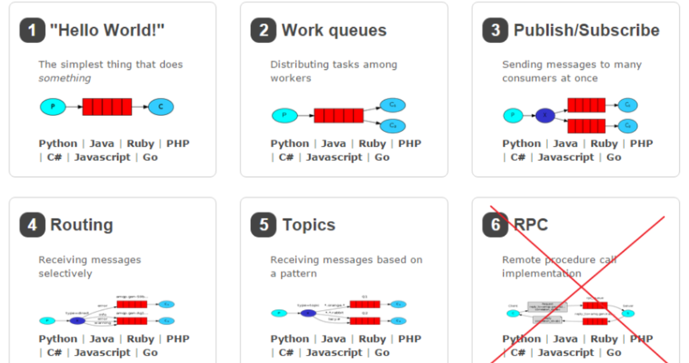

## RabbitMQ

1. mq用在项目哪个模块？

   异步处理：将不是必须的业务逻辑加入消息队列做后续处理，快速给予用户响应(比如发短信和发邮件异步执行。)

   应用解耦：比如服务间调用可以通过中间件传递，使程序的耦合度减小，下单时锁定库存通知。

   流量削峰：一般在并发量高的场景下，用户的请求,服务器收到之后,首先写入消息队列,加入消息队列长度超过最大值,则直接抛弃用户请求或跳转到错误页面，后台业务根据消息队列中的请求信息，再做后续处理。（秒杀和团购）。

   分布式事务：下单锁定库存，防止下单出现异常，库存未解锁。

   数据上报：我们的数据通过采集器采集上报到kafka，然后消费到hbase。

   异步发送短信通知、mq实现分布式事务、上报数据。

2. mq两种主流的实现方式？

   JMS：Java Message Service，java消息服务。java api，是java规范，只能使用java实现；支持两种消息模型（点对点 发布订阅）

   AMQP: Advanced Message Queuing Protocol，高级消息队列协议。本质是一个协议，规范了数据格式；任何语言都可以实现；

3. rabbitmq消息模式有几种，使用的哪个模式？

   

   rabbitmq有五种消息模型:

   1、基本消费模型：(simple)点对点， 生产者——>队列——>一个消费者

   2、工作队列：(work)可以搭建消费者集群，生产者——>队列——>多个消费者共同消费

   3、订阅模型——Fauout：（publish/subscribe）广播，将消费交给所有绑定交换机的队列，每个消费者都可以收到同一条消息。

   4、订阅模型——Direct：（Routinng，发布订阅之路由）定向，将消息交给符合指定rotingKey的队列（路由模式）

   5、订阅模型——Topic：（Topics，发布订阅之通配符）把消息交给符合routing pattern（主题模式）的队列。

   我们使用的是Topics模式，3、4、5这三种都属于订阅模型，只不过进行路由的方式不同。

4. rabbitmq的交换机和路由键？

   交换机（exchage），可以接收消息并转发消息，不能存储消息,交换机类型有3种：

   fanout：广播，所有队列可以获取消息。

   direct：路由，定向发送消息到队列。

   topic：通配符，支持通配符。

   路由键（Routing key）： exchange可以根据路由键定向发送消息。

5. mq的优缺点？

   优点：异步、解耦、削峰

   缺点：项目架构变得复杂，中间件的及服务的调用可能更容易出现问题，维护成本高。

6. 项目中有没有遇到消息队列的问题？有没有遇到过消息丢失的问题?

7. rabbitMQ避免消息丢失？

   * 生产者确认：spring.rabbitmq.publisher-confirm-type=correlated/simple/none

     ​					   spring.rabbitmq.publisher-returns=true

     ​						java配置
     ​									rabbitTemplate.setConfirmCallback()
     ​									rabbitTemplate.setReturnCallback()

   * 消息持久化：交换机持久化（默认） 队列的持久化   消息持久化（默认），主要将队列设置持久化

   * 消费者确认：原生代码：自动确认（ACK） 手动ACK（channel.basicAck()）

     ​					 springRabbit：三种模式
     ​				     自动确认模式：消费者监听器正常执行，则确认消息；消费者监听器执行异常，无线重试。
     ​				    不确认模式：相当于原生中的自动确认，不推荐
     ​				   手动确认模式：
     ​					channel.basicAck
     ​					channel.basicNack
     ​					channel.basicReject

8. rabbitmq怎么保证生产者投递消息到mq服务器成功，怎么保证消费被消费，如何保证事务安全？

   保证生产者投递消息到mq成功：

   * confirm机制(确认应答机制)。
   * 如果消费者消费消息失败了，生产者是不需要回滚事务的，消费者采用手动ack应答模式，mq进行补偿重试，进行消息补发（注意幂等性）。

   rabbitmq解决分布式事务原理：采用最终一致性原理。保证消费成功：

   * 确保生产者投递消息到MQ服务器一定能成功 ，confirm机制(确认应答机制)
   * 队列、交换机、消息都需要持久化（可以考虑镜像队列机制，如果业务不是那么重要，比如短信邮件通知）
   * MQ消费者消息能够正确消费消息，采用手动ACK模式（注意重试幂等性问题）

9. rabbitmq消息堆积怎么办？

   消息堆积主要是生产方生产消息远超过消费方的承受能力这时候我们可以：

   - 工作模型：对消费者搭建集群。
   - 开启多线程消费：spring.rabbitmq.listener.simple.concurrency=4
   - 能者多劳：channel.basicQos(1)  或者 spring.rabbitmq.listener.simple.prefetch=1

10. rabbitmq如何避免消息重复消费，即幂等性？

   让每个消息携带一个全局的唯一ID比如（UUID），即可保证消息的幂等性，具体消费过程为：

   * 消费者获取到消息后先根据Id去查询redis/db是否存在该消息；
   * 如果不存在，则正常消费，消费完毕后将该ID写入redis/db。
   * 如果存在，则证明消息被消费过，直接丢弃。

   如果需要存入db的话，可以直接将这个ID设为消息的主键，下次如果获取到重复消息进行消费时，由于数据库主键的唯一性，则会直接抛出异常。

11. rabbitmq如何保证消息的顺序性？[具体参考](https://blog.csdn.net/AAA821/article/details/86650471)

    - 在 MQ 里面创建多个 queue，同一规则的数据（对唯一标识进行 hash），有顺序的放入 MQ 的 queue 里面，消费者只取一个 queue 里面获取数据消费，这样执行的顺序是有序的。
    - 或者就一个 queue 但是对应一个 consumer，然后这个 consumer 内部用内存队列做排队，然后分发给底层不同的 worker 来处理。

    

12. rabbitmq的延迟队列？

## Kafka

1. kafka如何保证消息顺序消费？

   - 一个 topic，一个 partition，一个 consumer，内部单线程消费，单线程吞吐量太低，一般不会用这个。

   - 写 N 个内存 queue，具有相同 key 的数据都到同一个内存 queue；然后对于 N 个线程，每个线程分别消费一个内存 queue 即可，这样就能保证顺序性。

     

2. consumer 是推还是拉？

   kafka默认使用pull模式。

   