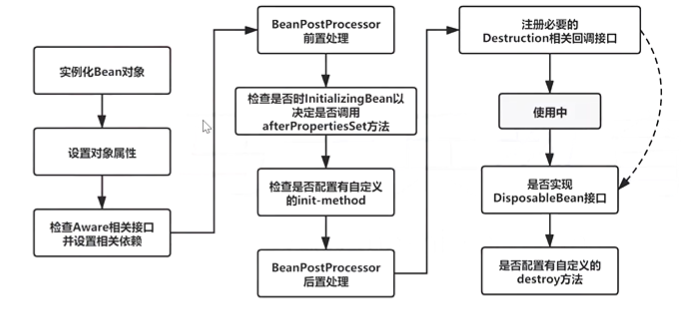
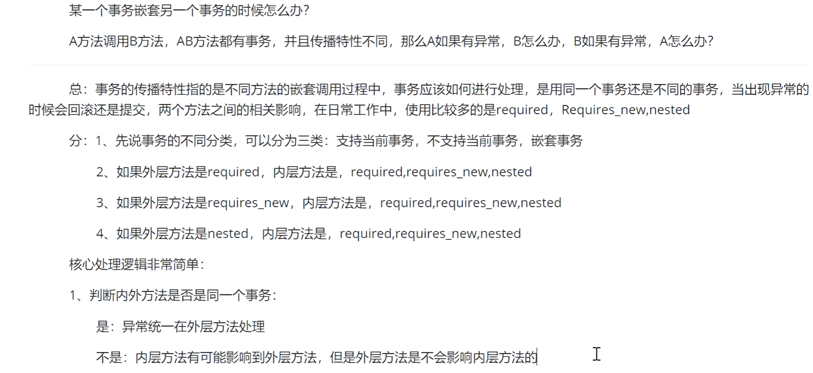
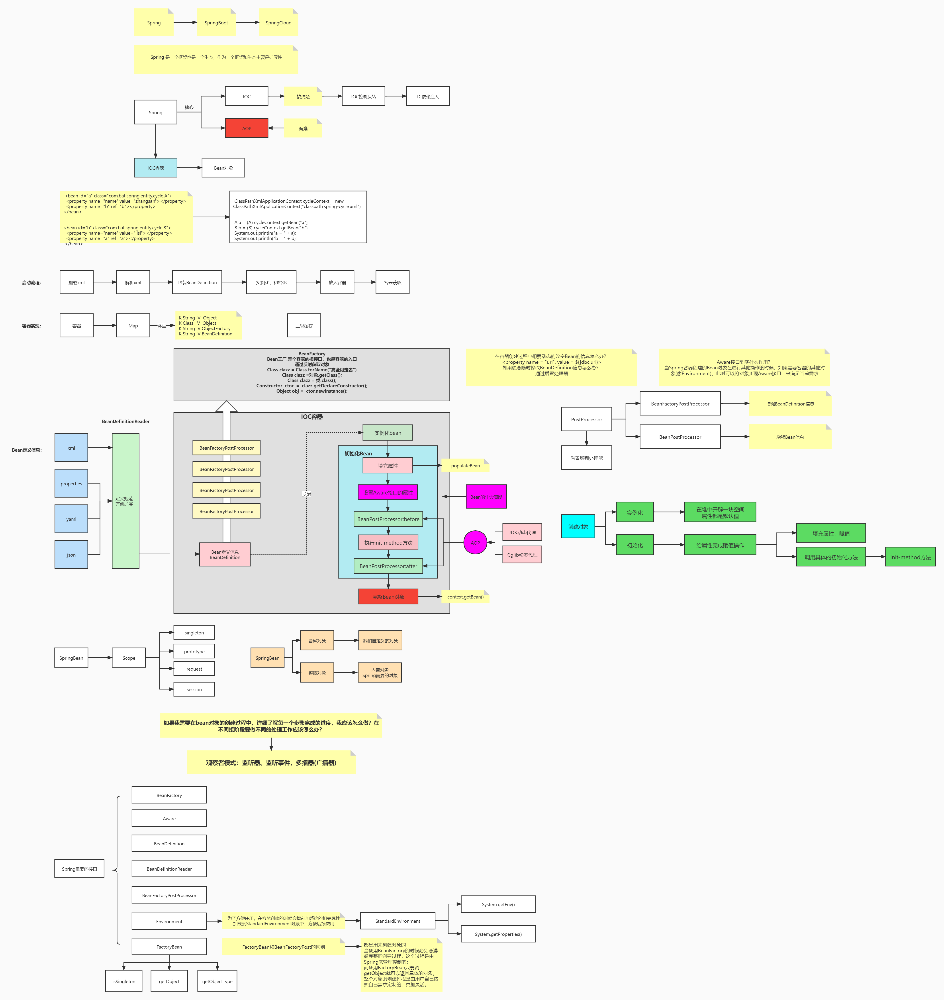

答题技巧：

总：当前问题回答的是哪些具体的点

分：以1、2、3、4、5的方式分细节取描述相关的知识点，如果有哪些不清楚，直接省略过去，突出一些技术名词（核心概念、接口、类、关键方法）

多说避免面试官多问，问到自己熟悉的一定尽量拖时间。

避重就轻

# 0、谈下你对Spring的理解？看过源码吗？哪个最熟悉？

spring -------->springmvc----------->springboot-------------->springcloud

spring是一个最基本的框架，spring全家桶是依赖于spring框架来构成的，在spring中包括两个核心的关键点，第一个是IOC表示Spring是最基本的一个容器；第二个是AOP，它提供了面向切面编程的这种思路，可以帮助我们在日志事务等各个层面，进行相关的一些扩展工作。

当然这些都是官方的描述，其实Spring就是一个基本的框架，它提供了基本的容器功能，该容器是用来存放具体的Bean对象的，当有了这些Bean对象后，为方便我们对Bean对象的获取，需要先声明好配置文件或注解，告诉Spring容器，你需要什么样的对象。

注解或配置文件定义好就开始解析了，通过IO流，Document文档去解析里边的标签，解析里边的属性值，解析后的文件我们称为BeanDefinition简称BD，根据BD中的描述信息来进行对象的实例化操作，通过反射的方式创建具体的对象，之后就可以通过Context.getBean()获取Bean对象。

Spirng作为一个容器，从创建到销毁，都不需要人为干预。

作为一个框架，最基本最主要的就是扩展性，在Spring中提供了一扩展点，让用户来随意进行扩展工作。在创建对象之前会有一个扩展点，BeanFactoryPostProcessor可以替换配置文件中的占位符，在BFPP还包含了BeanDefiintionRegistryPostProcessor可以随意地创建BD对象，SpingBoot的自动装配原理：通过ConfigurationClassPostProcessor来实现。

Spring扩展在设计的时候留出了很多口子，让用户能够进行扩展工作。

Spring中启动流程中postprocessBeanFactory和onRefresh方法就可以扩展实现

第一方法的时候，其实很简单，方法的参数是beanFactory，所以可以通过add,set,register的方式向容器中添加任何的对象。

第二个方法OnRefresh没有参数，可以任意定义核心的功能组件，当具体进行调用的时候，需要继承当前的父类，在子类方法中进行扩展实现，调用的时候会直接找到子类方法执行，像Spring boot中的tomcat就是通过createWebServer方法实现的。

在前期完成基本的扩展工作后，开始进行bean对象的实例化操作，也就是整个生命周期。具体分为实例化和初始化，其中实例化是通过CreateBeanInstance来完成的，比如有new factorybean。

AOP也是在IOC基础之上完成的扩展功能。


# 1、谈谈Spring IOC

# 的理解，原理与实现？

**总：**

控制反转：理论思想，原来的对象是由使用者来控制，有了Spring之后，可以把整个对象交给Spring来帮我们进行管理。DI依赖注入，把对应的属性注入到具体的对象中，可以通过@Autowired、populateBean完成属性的注入。

容器：存储对象，使用map结构来存储，在Spring中一般存在三级缓存，singletonObjects存放完整的bean对象，整个bean的生命周期，从创建到使用到销毁的过程全部都是由容器进行管理(bean的生命周期)

**分：**

1、一般聊Ioc容器的时候涉及到容器的创建过程(beanFactory，DefaultListableBeanFactory),向bean工厂中设置一些参数（BeanPostProcessor，Aware接口的子类）等等属性

2、加载解析bean对象，准备要创建的bean对象的定义对象beanDefinition（xml或者注解的解析过程）

3、beanFactoryPostProcessor的处理，此处是扩展点，PlaceHolderConfigurSupport、ConfigurationClassPostProcessor

4、BeanPostProcessor的注册功能，方便后续对bean对象完成具体的扩展功能

5、通过反射的方式将BeanDefinition对象实例化成具体的bean对象

6、bean对象的初始化过程（填充属性，调用aware子类的方法，调用BeanPostProcessor前置处理方法、调用init-method方法，调用BeanPostProcessor的后置处理方法）

7、生成完整的bean对象，通过getBean方法可以直接获取

8、销毁过程

面试官，这是我对ioc的整体理解，包含了一些详细的处理过程，您看一下有什么问题，可以指点我一下(允许你把整个流程说完)

要是没看过源码怎么办？把总体的说完后可以接着说：具体细节我不记得了，但是spring中的bean都是通过反射的方式生成的，同时其中包含了许多扩展点，比如最常用的对BeanFactory的扩展，对bean的扩展（对占位符的处理），我们公司对这方面的使用是比较多的(提前准备)，除此之外，ioc中最核心的就是填充bean属性，和生命周期(背一下)

# 2、谈一下Spring IOC的底层实现？

   底层实现：工作原理、过程、数据结构、流程、设计模式、设计思想

不用上面那么复杂，说下你的理解和你了解的实现过程即可


反射、工厂、设计模式（会的说不会的不说），关键的几个方法

createBeanFactory、getBean、doGetBean、createBean、doCreateBean、createBeanInstance(getDeclaredConstructor，newInstance)，populateBean、initializingBean

1、先通过createBeanFactory创建一个Bean工厂(DefaultListableBeanFactory)

2、开始循环创建对象，因为容器中的bean默认都是单例的，所以先通过getBean，doGetBean从容器中查找，找不到的话

3、通过createBean、doCreateBean方法，以反射的方式创建对象，一般情况下使用的是无参的构造方法(getDeclaredConstructor，newInstance)

4、进行对象的属性填充populateBean

5、进行其他的初始化操作(initializingBean)

# 3、描述一下bean的生命周期？

背图：网上的图，记住其中的流程



在表述的时候不要只说图中有的关键点，要学会扩展描述

1、实例化bean：反射的方式生成对象

2、填充bean的属性：populateBean()，在此可以引出循环依赖的问题(三级缓存)

3、调用aware接口相关的方法:invokeAwareMethod(完成BeanName、BeanFactory、BeanClassLoader对象的属性设置)

4、调用BeanPostProcessor中的前置处理方法：使用比较多的有（ApplicationContextPostProcessor，设置ApplicationContext、Environment、ResourceLoader、EmbeddedValueResolver等对象）

5、调用initMethod方法:invokeInitMethod判断是否实现了initializingBean接口，如果有调用afterPropertiesSet方法，没有就不调用

6、调用BeanPostProcessor的后置处理方法：Spring的aop会在此处实现（AbstractAutoProxyCreator实现类，前置方法也会实现aop）

注册Destruction相关的回调接口：钩子函数

7、获取到完整的对象，可以通过getBean的方式来进行对象的获取

8、销毁流程，1、判断是否实现了DisposableBean接口，2、调用destroyMethod方法

# 4、Spring是如何解决循环依赖问题的？

总：什么是循环依赖问题,它是指两个或者两个以上的bean(包括自己依赖自己)之间的相互依赖形成闭环。

分：比如beanA和beanB的相互依赖，循环依赖是在bean的创建过程中产生的，bean的创建主要是实例化和初始化(填充属性)

1、先创建A对象，实例化A对象，此时A对象中的b属性为空，需要填充b属性

2、那么会到容器查找B对象，如果找到了，直接进行赋值就不存在循环依赖问题了(不通)，找不到直接创建B对象

3、实例化B对象，此时B对象中a属性为空，填充属性a

4、从容器中查找A对象，找不到，直接创建

以上是形成了闭环的原因

此时，如果仔细琢磨就会发现A对象是存在的，只不过此时的A对象不是一个完整的状态，只完成了实例化但是未完成初始化，在程序调用的过程中，如果拥有了某个对象的引用是可以在后期给他完成赋值操作的，那么就可以给非完整状态的对象优先赋值，等待后续操作来完成赋值，相当于提前暴露了某个不完整对象的引用，所以解决问题的核心在于实例化和初始化分开操作，这是解决循环依赖的关键。

当所有对象都完成实例化和初始化操作之后，还要把完整的对象放到容器中，此时的容器中存在着两种对象的状态，一种是完成实例化未完成初始化、一种是完整状态，因为都在容器中，所以要使用不同的map结构来进行存储，此时就有了一级缓存和二级缓存，如果一级缓存中有了，那么二级缓存中就不会存在同名的对象，因为他们的查找顺序是1、2、3这样的方式来查找的。一级缓存中存在的是完整对象，二级缓存中存放的是非完整对象。

那么为什么需要三级缓存呢，二级缓存其实已经解决了循环依赖的问题。三级缓存的value类型是ObjectFactory，是一个函数式接口，存在的意义是保证在整个容器的运行过程中同名的bean对象只能有一个。

如果一个对象需要被代理，或者说要生成代理对象，那么要优先生成一个普通的对象。由于普通对象和代理对象是不能同时出现在容器中的，因此当一个对象需要被代理的时候，就要使用代理对象覆盖掉之前的普通对象，在实际调用过程中，是没有办法确定什么时候对象被使用，所以就要求当某个对象被调用的时候，优先判断此对象是否需要被代理类似一种回调机制的实现，因此传入Lambda表达式的时候，可以通过Lambda表达式来执行对象的覆盖过程，通过getEarlyBeanReference()方法。

# 4.1缓存的放置时间和删除时间

三级缓存：createBeanInstance之后: addSingletonFactory

二级缓存：第一次从三级缓存确定对象是代理对象还是普通对象的时候，同时删除三级缓存getSingleton

一级缓存：生成完整对象之后放到一级缓存，删除二三级缓存：addSingleton

# 5、BeanFactory与FactoryBean的区别？

相同点：都是用来创建bean对象的

不同点：使用BeanFactory创建对象的时候，必须要遵循严格的生命周期流程太复杂了，如果要简单的自定义某个对象的创建，同时创建完成的对象交给spring来管理，那么就需要实现FactoryBean接口了

FactoryBean里面有三个方法：

isSingleton：是否是单例

getObjectType：获取返回对象的类型

getObject： 自定义创建对象的过程（new，反射，动态代理）

个人理解：BeanFactory批量生产，FactoryBean是定制(比如自己想要一件喜欢的衣服，没必要走批量生产流程，私人定制更好更满意)

# 6、Spring中用到的设计模式？

**单例模式**：spring中的bean默认都是单例的

原型模式：指定作用域为prototype

**工厂模式**：BeanFactory

**模板方法**：postProcessBeanFactory、onRefresh、initPropertyValue

**策略模式**：BeanDefinitionReader(XMLBeanDefinitionReader、PropertiesBeanDefinitionReader)

**观察者模式**：spring中的事件监听使用的就是观察者模式，listener、event、multicast

适配器模式：Adapter

装饰者模式：BeanWrapper、InputSource

责任链模式：在aop的通知执行的时候会使用（过滤器、拦截器的执行）
**代理模式**：AOP的实现机制动态代理，cglib动态代理和jdk动态代理

委托者模式：delegate

**建造者模式**：以builder后缀的实现

notes:加粗的表示应该用过的，可以熟悉一下，用来面试。设计模式之禅，大话设计模式

# 7、Spring的Aop的底层实现原理？

动态代理

spring 的aop是ioc的一个扩展功能，先有的ioc, 再有的aop，只是在ioc的整个流程中新增的一个扩展点而已：BeanPostProcessor

记住：要学会总分思想，先总后分

总：aop概念（可以展开）、应用(日志、事务等)、动态代理

分：

bean的创建过程中有一个步骤可以对bean进行扩展实现，aop本身就是一个扩展功能，所以在BeanPostProcessor的后置处理方法中来进行实现

1、代理对象的创建过程（advice、切面、切点）

2、通过JDK或者Cglib的方式来生成代理对象

3、在执行方法调用的时候，会调用到生成的字节码文件中，直接会找到DynamicAdvisoredInterceptor类中的intercept方法，从此方法开始执行

4、根据之前定义好的通知来生成拦截器链

5、从拦截器链中依次获取每一个通知开始进行执行，在执行过程中，为了方便找到下一个通知是哪个，会有一个CglibMethodInvocation的对象，找的时候是从-1的位置依次开始查找并且执行的。

# 8、Spring的事务是如何回滚的？

spring的事务管理是如何实现的？

总：spring的事务是由aop来实现的，首先要生成具体的代理对象，然后按照aop的整套流程来执行具体的操作逻辑，正常情况下要通过通知来完成核心功能，但是事务不是通过通知来实现的，而是通过一个TransactionInterceptor来实现的，然后调用invoke来实现具体的逻辑

分：1、先做准备工作，解析各个方法上事务相关的属性，根据具体的属性来判断是否开启新事务

​        2、当需要开启的时候，获取数据库连接，关闭自动提交功能，开启事务

​        3、执行具体的sql逻辑操作

​		4、在操作过程中如果执行失败了，那么通过completeTransactionAfterThrowing来完成事务的回滚操作，回滚的具体逻辑是通过doRollBack方法来实现的，实现的时候也是要先获取到连接对象来回滚。

​        5、如果执行过程中，没有任何意外情况的发生，那么通过commitT然撒错题onAfterReturning来完成事务的提交操作，提交的具体逻辑通过doCommit方法来实现的，实现的时候也是要获取连接，通过连接对象来提交。

​		6、当事务执行完毕之后需要清除相关的事务信息cleanupTransactionInfo。

如果想要聊得更细的话，需要知道TransactionInfo，TransactionStatus。


# 9、谈一下Spring事务传播？

传播特性有7种

Required、Requires_new、nested、support、notSupport、never、Mandatory




others:

首先聊spring，在spring ioc中有一个BeanFactoryPostProcessors
调用invokeBeanFactoryPostProcessors的时候会执行ConfigurationClassPostProcessor类里面的processConfigBeanDefinitions方法就会解析启动类注解@SpringBootApplication里面的@EnableAutoConfiguration中的@Import注解
然后实例化@Import导入的类执行getImports获取到META-INF/spring.factories文件
通过EnableAutoConfiguration这个key获取到需要装配的类，然后过滤返回。


**NOTES：**结合思维导图



找工作心得：

```
1、面试之前一定要调整好心态，不管你会多少东西，干就完了，出去面试就一个心态，老子天下第一，让自己超常发挥
2、得失心不要太重，全中国企业很多，好公司也有很多，没必要在一棵树上吊死，你可以有心仪的公司，留到最后，等你准备充分再去
3、找工作永远不可能准备好，不能怂，心态不好，不敢出去面试，我要准备，先按照自己的技术储备去尝试一些公司（我就是来试水的）面试回来之后做总结，做好准备，不断总结，复盘，这样才能成长。
```

